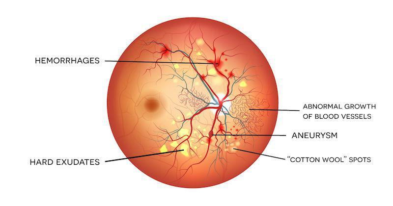
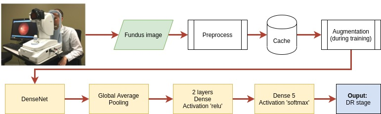

# Diabetic Retinopathy Detection on color fundus image 

[Link to dataset](https://www.kaggle.com/c7934597/resized-2015-2019-diabetic-retinopathy-detection)

## What is Diabetic Retinopathy (DR) ?
- Diabetes is a chronic disease that occurs when human body cannot produce or effectively use insulin to regulate a proper level of blood sugar.
- Overtime, diabetes can result in several complications, including Diabetic Retinopathy (DR).
- DR is one of the global leading causes of blindness in adults. It damages the eye's retina gradually, and can lead to permanent blindness if left untreated.
- Put it simple, among 3 people have diabetes, one can get DR.
- Get diagnosed and treated in early stages of DR can significantly reduce the risk of vision loss.

Below is a visualization of DR's symptoms on a fundus image

## Challenges of the traditional DR diagnosis
### Accesibility
- Diagnosis process usually acquires specialized machine to capture the image of the retina (called fundus image) and a trained doctor to diagnosis the photo [(link)](https://www.youtube.com/watch?v=M6IlOKXlCqs&list=PL0kc7lQdKnHp_dBNgwSCxi3Vrvrms1k4B&index=5&ab_channel=NationalEyeInstitute%2CNIHNationalEyeInstitute%2CNIH)
- The requirement is not always accessible for the many, especially a trained doctor to diagnose in low and middle-income countries where the increase rate of diabetics are higher.
- Applying machine learning to detect DR helps reduce significantly time, cost, and technical requirements for early DR diagnosing, thus save DR patient from vision loss.
### Inconsistency of doctor's estimation
- Given the image of the same patient's eye, several doctor may have different opinions in DR diagnosis.
- If human doctors diagree on their predictions on the same image, can we train the machine to do better ? We'll never know if not give it a try.

## Use case in a general: 
- After the fundus color image is taken by a technician with a specialized machine, the image can be croped and resize, then put in the model. The model will predict if the patient has DR or not, and which stage it is.

## About the dataset
The dataset combines images from 2 Kaggle competitions in [2015](https://www.kaggle.com/c/diabetic-retinopathy-detection) and [2019](https://www.kaggle.com/c/aptos2019-blindness-detection) on the same problems.

There are > 92,000 fundus images. Each was resized and cropped to have a maximum size of 1024px. One clinician was asked to rate each image for the severity of diabetic retinopathy on a scale of 0 to 4:

0. No DR
1. Mild non-proliferative DR (NPDR)
2. Moderate NPDR
3. Severe NPDR
4. Proliferative DR

## Problem definition
This is an **ordinal multi-class single-label image classification problem**

## Technical information
- Language: Python with Jupyter Notebook
- Platform: Google Colaboratory
- Framework: TensorFlow, OpenCV
- Transfer learning with pretrained DenseNet. Other transfer learning were tried, such as MobileNetv2, Inception, EfficientNetB7, VGG16, but not as good as DenseNet
- The pipeline that I used to tackle the problem:

- Loss function: **Quadratic Weighted Kappa loss**. For oridinal-class classification problem, this function help the gradient converge more effectively 
- The dataset is highly imbalance, with class 0 dominant (72,7%). This is a typical case of medical data.

    To counter imbalance dataset:
    - Calculate class weight
    - Oversampling with SMOTE combine with image augmentation to generate more images of minority class
    - Performance metric:

        - Accuracy is not good in imbalance dataset
        - Use Quadratic Weighted Kappa
        - Area Under Curve for precision-recall curve (better than ROC curve because it's not dependent on imbalance dataset)
        
            Besides, false negative is more costly than false positive, as we don't want DR patient left unchecked. So it makes more sense to use the performance metric with recall

- Dataset has wide image variation due to many reasons (e.g. combined dataset, different clinics, cameras were used). Image may contain artifacts, be out of focus, underexposed, or overexposed

    To counter: 

    - Preprocess image with center crop, [Ben's color filter](https://www.kaggle.com/ratthachat/aptos-eye-preprocessing-in-diabetic-retinopathy/notebook#2.-Try-Ben-Graham's-preprocessing-method.)

## Current results (updated on Jun 25, 2021)
- [Presentation slides](https://docs.google.com/presentation/d/1DEc39D7iKhSZdLAZA5PGJsAlleuP5EFJfvvfMsussdk/edit?usp=sharing) for the final project (June 25, 2021)
- Quadratic Weighted Kappa metric: 0.4 (best on Kaggle for 2015 dataset: 0.84)
- At the moment, my bottleneck is the training speed of the model. With OpenCV for image preprocessing and because it can not utilized GPU, it slows down the whole process. One training epoch (batch 16) for just 20% dataset took about 11 minutes to finish. That significantly blocks me from trying and tuning the model.

## References
- https://www.kaggle.com/ratthachat/aptos-eye-preprocessing-in-diabetic-retinopathy/notebook#2.-Try-Ben-Graham's-preprocessing-method.
- https://www.kaggle.com/c/aptos2019-blindness-detection/discussion/107987
- https://www.youtube.com/watch?v=EnmbYbGxyuc&list=PL0kc7lQdKnHp_dBNgwSCxi3Vrvrms1k4B&index=3&ab_channel=Docplexus
- https://www.youtube.com/watch?v=M6IlOKXlCqs&list=PL0kc7lQdKnHp_dBNgwSCxi3Vrvrms1k4B&index=5&ab_channel=NationalEyeInstitute%2CNIHNationalEyeInstitute%2CNIH